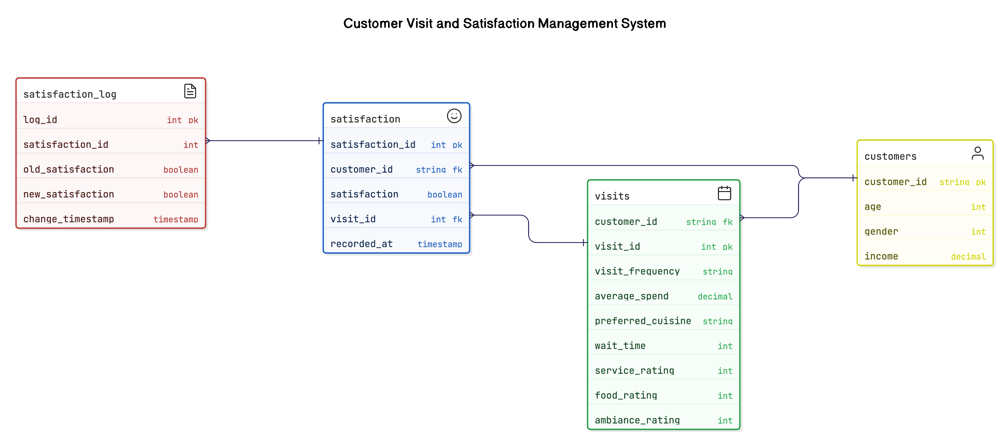

# DATABSE DESIGN FORMATIVE (PEER GROUP 2)

## Task 1: Database Design and Schema
Contributor: Glen Miracle
Responsibilties:
The following are the main things I was responsible for:
- Database Creation
- Entity Relation Diagram
- Database Schema design
- Seeding Scripts
- Creating Mongodb clusters and db's
- deploying databases

# Schema Files
```sql
-- Create Customers table
CREATE TABLE Customers (
    customer_id VARCHAR(10) PRIMARY KEY, -- Assuming CustomerID is a string like "CUST123"
    age INT NOT NULL CHECK (age >= 18),
    gender INT NOT NULL CHECK (gender IN (0, 1)), -- 0 = Male, 1 = Female
    income DECIMAL(10, 2) NOT NULL CHECK (income >= 0)
);

-- Create Visits table
CREATE TABLE Visits (
    visit_id SERIAL PRIMARY KEY,
    customer_id VARCHAR(10) REFERENCES Customers(customer_id) ON DELETE CASCADE,
    visit_frequency VARCHAR(20) NOT NULL CHECK (visit_frequency IN ('Daily', 'Weekly', 'Monthly', 'Rarely')),
    average_spend DECIMAL(6, 2) NOT NULL CHECK (average_spend >= 0),
    preferred_cuisine VARCHAR(50) NOT NULL,
    wait_time INT NOT NULL CHECK (wait_time >= 0),
    service_rating INT NOT NULL CHECK (service_rating BETWEEN 1 AND 5),
    food_rating INT NOT NULL CHECK (food_rating BETWEEN 1 AND 5),
    ambiance_rating INT NOT NULL CHECK (ambiance_rating BETWEEN 1 AND 5)
);

-- Create Satisfaction table
CREATE TABLE Satisfaction (
    satisfaction_id SERIAL PRIMARY KEY,
    customer_id VARCHAR(10) REFERENCES Customers(customer_id) ON DELETE CASCADE,
    visit_id INT REFERENCES Visits(visit_id) ON DELETE CASCADE,
    satisfaction BOOLEAN NOT NULL, -- 0 = Not Satisfied, 1 = Satisfied
    recorded_at TIMESTAMP DEFAULT CURRENT_TIMESTAMP
);

-- Stored Procedure: Insert a new customer visit and satisfaction record
CREATE OR REPLACE PROCEDURE add_customer_visit(
    p_customer_id VARCHAR,
    p_age INT,
    p_gender INT,
    p_income DECIMAL,
    p_visit_frequency VARCHAR,
    p_average_spend DECIMAL,
    p_preferred_cuisine VARCHAR,
    p_wait_time INT,
    p_service_rating INT,
    p_food_rating INT,
    p_ambiance_rating INT,
    p_satisfaction BOOLEAN
)
LANGUAGE plpgsql AS $$
DECLARE
    v_visit_id INT;
BEGIN
    -- Insert into Customers if not exists
    INSERT INTO Customers (customer_id, age, gender, income)
    VALUES (p_customer_id, p_age, p_gender, p_income)
    ON CONFLICT (customer_id) DO NOTHING;

    -- Insert into Visits
    INSERT INTO Visits (customer_id, visit_frequency, average_spend, preferred_cuisine, wait_time, service_rating, food_rating, ambiance_rating)
    VALUES (p_customer_id, p_visit_frequency, p_average_spend, p_preferred_cuisine, p_wait_time, p_service_rating, p_food_rating, p_ambiance_rating)
    RETURNING visit_id INTO v_visit_id;

    -- Insert into Satisfaction
    INSERT INTO Satisfaction (customer_id, visit_id, satisfaction)
    VALUES (p_customer_id, v_visit_id, p_satisfaction);
END;
$$;

-- Trigger: Log changes to Satisfaction table
CREATE TABLE Satisfaction_Log (
    log_id SERIAL PRIMARY KEY,
    satisfaction_id INT,
    old_satisfaction BOOLEAN,
    new_satisfaction BOOLEAN,
    change_timestamp TIMESTAMP DEFAULT CURRENT_TIMESTAMP
);

CREATE OR REPLACE FUNCTION log_satisfaction_changes()
RETURNS TRIGGER AS $$
BEGIN
    IF TG_OP = 'UPDATE' THEN
        INSERT INTO Satisfaction_Log (satisfaction_id, old_satisfaction, new_satisfaction)
        VALUES (OLD.satisfaction_id, OLD.satisfaction, NEW.satisfaction);
    END IF;
    RETURN NEW;
END;
$$ LANGUAGE plpgsql;

CREATE TRIGGER satisfaction_change_trigger
AFTER UPDATE ON Satisfaction
FOR EACH ROW
EXECUTE FUNCTION log_satisfaction_changes();
```

## ERD Diagram



## Task 2:  APIs
Contributor: Jordan Nguepi
-created api for all CRUD operations on the 3 data models
---
`Data Models`
Customer, Visit, Satisfaction

 api address:
`https://db-design-formative.onrender.com/api/'  

available endpoint: 
---
`api/customers/`
methods: LIST, CREATE, UPDATE, DELETE
---
`api/visits/`
methods: LIST, CREATE, UPDATE, DELETE
---
`api/satisfactions/`
methods: LIST, CREATE, UPDATE, DELETE


---
## **Task 3 - Fetching Data & Predicting Customer Satisfaction**  
**Contributor:** Peter Johnson  

### **Responsibilities**  
In this project, I handled Task 3, which involved:  
- Fetching the latest customer data from the API  
- Preprocessing the data (categorical encoding, feature scaling)  
- Loading and using a trained neural network model to predict customer satisfaction  

### **Key Steps Implemented**  
1. **API Integration**  
   - Connected to the Django API to retrieve the most recent customer entry  
   - Extracted the last entry 

2. **Data Preprocessing**  
   - Standardized numerical features with Feature Scaling  

3. **Model Deployment**  
   - Trained and used a neural network model (Best Model From Intro To ML)  
   - Loaded `trained_customer_satisfaction_model.keras` for predictions  

4. **Database Logging**  
   - Logged predictions into the PostgreSQL database  

### **Technologies Used**  
- Python  
- TensorFlow/Keras  
- Django REST Framework  
- PostgreSQL  
- Scikit-Learn  

### **Repository Structure**  
- `db_directory/`→ Database Schema and tables
- `api_directory/` → Django API  
- `ml-directory/` → ML model & and predictions
- `Task_3_PETER_JOHNSON.ipynb` → Task 3 implementation  
- `trained_customer_satisfaction_model.keras` → Trained model  


